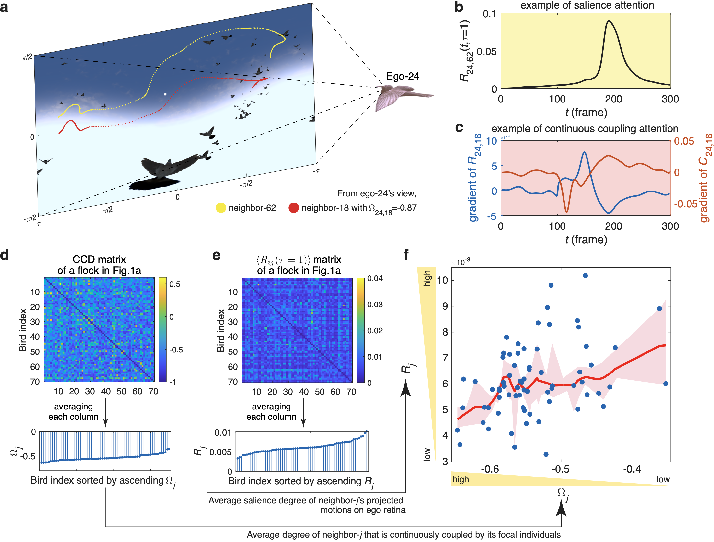

# Retinal_Cues

## 1. Bird flocking datasets

In this work, we leverage a total of 140, 94, and 1483 short tracks from [mobbing](http://www.nature.com/articles/s41467-019-13281-4), [transit](http://www.nature.com/articles/s41467-019-13281-4) and [circling](https://royalsocietypublishing.org/doi/10.1098/rspb.2016.2602) datasets, respectively. The original mobbing and transit datasets were obtained from video recordings that captured the three-dimensional movements (with 60 frame/s) of wild jackdaws (*Corvus monedula*) in Cornwall, UK. The circling dataset recorded three-dimensional tracks (with 30 frame/s) of a very large flock consisted of ~1,800 chimney swifts (*Chaetura pelagica*) as they entered their overnight roost in Raleigh, USA. As the name implies, the mobbing flocks were observed participating in collective anti-predator behavior, with individuals coming together to investigate and repel a predator. The circling flocks, comprising hundreds of chimney swifts, exhibited a circling behavior as they approached the vicinity of a roost site from surrounding areas. The transit dataset captured the precisely coordinated and smooth movement of jackdaw flocks as they flew towards their winter roosts. Based on the described behaviors, it appears that the descending order of maneuverability for collective motions is as follows: mobbing flocks exhibit the highest maneuverability, followed by circling flocks, and then transit flocks (see SI Sec.1.2 for detailed information).

## 2. Schooling fish datasets

In [schooling fish dataset](https://royalsocietypublishing.org/doi/10.1098/rsif.2021.0142), groups of golden shiners (*Notemigonus crysoleucas*) were observed swimming freely in a 2.1 x 1.2 m experimental tank across various group sizes: 10, 30, and 70 shiners in three trials each. Each trial was filmed for a duration of 2 hours using a camera positioned 2 meters above the tank, capturing footage at a rate of 30 frames per second (see snapshots in Supplementary Figs.2-4). Given that the experiments were conducted in a water depth of 4.5–5 cm, it is assumed that all the fish were swimming in the same plane due to the shallow water depth. 

To describe the collective states of the fish shoals, we utilize the polarization and the rotation order parameter to classify the shoals into polarized, milling, swarm and transition states (Supplementary Figs.5-7). Due to the clear boundaries between the four states, the transitions among the polarized, milling, and swarm states must go through a transition state. In this study, we specifically select those periods characterized by polarized states to perform the analysis (SI Sec.2.2 and Supplementary Video 4). Finally, we generate a total of 130, 105 and 51 short tracks for shoals consisted of 10, 30 and 70 fish, respectively. In addition, given the assumption of planar motion and individual fish as undergoing rigid rotations during directional changes, we account for the visual occlusions in our analysis (Supplementary Video 4).

## 3. Quantifying allocation of attention to retinal cues

- We provided MATLAB codes to reproduce our main results in allocation of attention to retinal cues, including 
  - Fig.2: `Diagram_of_Fig2abc_for_group05.m` and `Diagram_of_Fig2def_for_group05.m`; 
  - Fig.3: `Diagram_of_Fig3abc_for_group05.m`; 
  - Fig.4: `Diagram_of_Fig4abc_for_group05.m`;
  - Fig.5: `Diagram_of_Fig5abcdef_for_30Fish.m`.
- We provided minimal dataset to reproduce the examples of bird flock and fish shoal that we showed in the main text, including
  - The trajectory of bird flock with 70 birds is deposited in `group_05.mat`;
  - The images, generated by UE5 to reconstruct ego-24's retinal plane, are deposited in `UE5_for_Retina_reconstruction` folder;
  - The 30-fish shoal: the recording images are deposited in `Frame_Image_30-fish-0084-traj013.mat` and trajectory is deposited in `30-fish` folder.

### Acknowledgements

There are several important works which support this project:

- [mobbing flocks](http://www.nature.com/articles/s41467-019-13281-4) 
- [circling flocks](https://royalsocietypublishing.org/doi/10.1098/rspb.2016.2602) 
- [transit dataset](http://www.nature.com/articles/s41467-019-13281-4) 
- [schooling fish dataset](https://royalsocietypublishing.org/doi/10.1098/rsif.2021.0142) 

### Licence

The source code is released under [GPLv3](https://www.gnu.org/licenses/) license.
